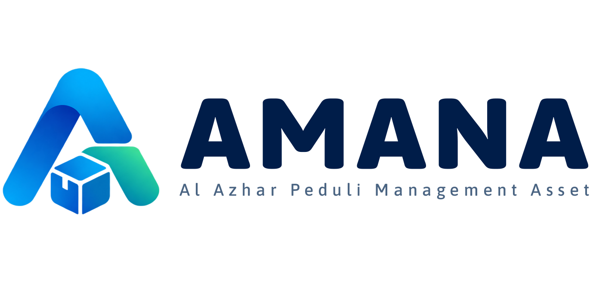

<p align="center">
  
</p>

<h3 align="center">AMANA — Aset Manajemen Al Azhar</h3>

<p align="center">
  Sistem informasi manajemen aset berbasis web untuk <strong>Lembaga Amil Zakat (LAZ) Al Azhar</strong>.<br>
  Dibangun dengan Laravel 13 · Tailwind CSS 4 · Alpine.js · Vite
</p>

<p align="center">
  
  
  
  
  
  
</p>

---

## 📋 Tentang AMANA

**AMANA** (Aset Manajemen Al Azhar) adalah aplikasi web internal yang dirancang untuk mengelola seluruh siklus hidup aset milik LAZ Al Azhar — mulai dari pencatatan, pelacakan, penyusutan, hingga pelaporan. Aplikasi ini menggantikan proses manual pengelolaan inventaris dengan sistem digital yang terpusat, lengkap dengan fitur QR Code untuk identifikasi aset secara cepat.

### Mengapa AMANA?

- 🏢 **Terpusat** — Seluruh data aset tersimpan dalam satu platform yang mudah diakses
- 📊 **Dashboard Analitik** — Ringkasan valuasi buku, penyusutan berjalan, dan statistik aset secara real-time
- 🔖 **QR Code** — Setiap aset dapat dilabel dengan QR Code untuk scan & identifikasi cepat
- 📅 **Kalender & Agenda** — Penjadwalan perawatan, servis, dan pemeriksaan aset berkala
- 📁 **Impor & Ekspor** — Migrasi data aset massal via Excel dengan fitur fuzzy-matching cerdas
- 🔒 **Audit Trail** — Seluruh perubahan data tercatat dalam log aktivitas

---

## ✨ Fitur Utama

### Manajemen Aset
| Fitur | Deskripsi |
|---|---|
| **Daftar Aset** | Pengelompokan aset ke dalam *Aset Tetap*, *Aset Kelolaan*, dan *Aset Non-Aktif* |
| **CRUD Aset** | Tambah, edit, lihat detail, dan hapus data aset lengkap |
| **Kode Aset Otomatis** | Generator kode aset terstruktur berdasarkan Divisi, Kategori, Barang, PIC, dan Lokasi |
| **Penyusutan** | Perhitungan penyusutan aset otomatis dengan metode garis lurus (nilai residu) |
| **Mutasi Aset** | Perpindahan aset antar lokasi / penanggung jawab dengan preview kode baru |
| **Ubah Status** | Perubahan status aset (aktif ↔ non-aktif) dengan pencatatan riwayat |

### Sub-Modul Aset
| Modul | Deskripsi |
|---|---|
| **Riwayat** | Catatan kronologis seluruh perubahan dan kejadian pada aset |
| **Agenda** | Penjadwalan kegiatan terkait aset (perawatan, servis, pemeriksaan) dengan siklus berulang |
| **Keuangan** | Pencatatan pengeluaran dan biaya terkait aset |
| **Jurnal** | Pencatatan jurnal akuntansi aset dengan status approval |

### Kalender & Pengingat
- Tampilan kalender interaktif untuk seluruh agenda aset
- Sistem reminder/pengingat untuk agenda yang mendekati jatuh tempo
- Siklus otomatis untuk agenda berulang (harian, mingguan, bulanan, tahunan)

### QR Code & Label
- Generasi QR Code untuk setiap aset
- Cetak label QR massal dalam format PDF
- Portal scan publik (`/p/{kode_aset}`) — akses info aset tanpa login
- Konfigurasi tampilan QR & portal publik yang fleksibel

### Impor & Ekspor Data
- **Impor** dari file Excel dengan staging area dan preview sebelum commit
- **Fuzzy matching** otomatis untuk mencocokkan data master (kategori, lokasi, PIC)
- **Ekspor** ke Excel dengan filter per grup aset
- **Kartu Aset PDF** — cetak kartu identitas aset individual

### Data Master
- **Kategori** — Hierarki kategori dan barang (dengan kode 2 huruf)
- **Lokasi** — Manajemen lokasi dengan kode, alamat, dan koordinat GPS
- **Merk** — Daftar merk/brand aset
- **Penanggung Jawab** — Data PIC aset (terintegrasi dengan data user)
- **Divisi** — Struktur divisi organisasi

### Administrasi & Keamanan
- **Manajemen Pengguna** — Buat, edit, nonaktifkan akun (role: `super_admin`, `viewer`)
- **Log Audit** — Seluruh aksi tercatat (siapa, kapan, apa yang berubah)
- **Autentikasi** — Login via email atau username dengan fitur "Ingat Saya"

---

## 🛠️ Tech Stack

| Layer | Teknologi |
|---|---|
| **Backend** | PHP 8.3, Laravel 13 |
| **Frontend** | Tailwind CSS 4, Alpine.js 3, Tabler Icons |
| **Build Tool** | Vite 8 |
| **Database** | SQLite (default) / MySQL / PostgreSQL |
| **PDF** | DomPDF (barryvdh/laravel-dompdf) |
| **Excel** | PhpSpreadsheet (phpoffice/phpspreadsheet) |
| **QR Code** | SimpleSoftwareIO/SimpleQrCode |
| **Charts** | ApexCharts |
| **Animasi** | Motion (Framer Motion Web) |
| **Font** | Plus Jakarta Sans (Google Fonts) |

---

## 🚀 Instalasi

### Prasyarat

- PHP ≥ 8.3
- Composer
- Node.js ≥ 18 & npm (atau Bun)
- SQLite / MySQL / PostgreSQL

### Setup Cepat

```bash
# 1. Clone repository
git clone https://github.com/sarpraslazalazhar-pixel/Amana.git
cd Amana

# 2. Jalankan setup otomatis (install deps, generate key, migrate, build assets)
composer setup

# 3. Seed data awal (users, kategori, lokasi, dll.)
php artisan db:seed
```

### Setup Manual

```bash
# 1. Install dependensi PHP
composer install

# 2. Salin file environment
cp .env.example .env

# 3. Generate application key
php artisan key:generate

# 4. Jalankan migrasi database
php artisan migrate

# 5. Install dependensi Node.js
npm install

# 6. Build assets frontend
npm run build

# 7. Seed data awal
php artisan db:seed
```

### Menjalankan Development Server

```bash
# Jalankan Laravel dev server + Vite secara bersamaan
composer dev
```

Aplikasi akan tersedia di: **http://localhost:8000**

---

## 🔑 Akun Default

Setelah menjalankan `php artisan db:seed`, tersedia akun berikut:

| Role | Email | Password |
|---|---|---|
| **Super Admin** | `admin@alazharpeduli.or.id` | `admin123` |
| **Viewer** | `viewer@alazhar.or.id` | `password123` |

> Pengaturan profil dan kata sandi akun dapat diubah sewaktu-waktu melalui menu **Profil Saya** (`/profil`).

---

## 🧪 Testing

Aplikasi dilengkapi dengan test suite yang mencakup seluruh fitur utama:

```bash
# Jalankan seluruh test
composer test

# Atau langsung via artisan
php artisan test
```

### Cakupan Test

| Kategori | Test |
|---|---|
| **Aset** | CRUD, Grup, Mutasi Kode, Submodul (Riwayat/Agenda/Keuangan/Jurnal) |
| **Impor/Ekspor** | Upload Excel, Preview, Commit, Download |
| **QR Code** | Print massal, Konfigurasi, Portal publik |
| **Dashboard** | Statistik, Chart, Redesign |
| **Kalender** | Agenda view, Reminder, Siklus reset |
| **Data Master** | Kategori, Lokasi, Merk, Penanggung Jawab |
| **Sistem** | User management, Audit log |
| **Unit** | Kode aset generator, Fuzzy matcher |

---

## 📂 Struktur Direktori

```
AMANA/
├── app/
│   ├── Http/Controllers/       # Controller utama & sub-controller
│   │   ├── DataMaster/         # Controller data master (Kategori, Lokasi, dll.)
│   │   └── Sistem/             # Controller sistem (User management)
│   ├── Models/                 # Eloquent models (16 model)
│   └── Services/               # Business logic services
│       ├── AgendaReminderService.php
│       ├── AsetExportService.php
│       ├── AsetFuzzyMatcher.php
│       ├── AsetImportService.php
│       ├── AuditLogger.php
│       ├── KalenderAsetService.php
│       ├── KodeAsetGenerator.php
│       ├── PenyusutanCalculator.php
│       └── QrCodeService.php
├── database/
│   ├── migrations/             # 27 migration files
│   └── seeders/                # Database seeder & master kode aset
├── resources/views/
│   ├── aset/                   # Views: daftar, create, edit, show, export, import, QR print
│   ├── dashboard/              # Dashboard dengan chart & statistik
│   ├── kalender/               # Kalender aset interaktif
│   ├── data-master/            # CRUD data master
│   ├── layouts/                # Layout utama, sidebar, header
│   ├── components/             # Blade components reusable
│   └── public/                 # Portal scan QR publik
├── routes/web.php              # Definisi seluruh route
└── tests/                      # Feature & Unit tests
```

---

## 📄 Lisensi

Proyek ini dilisensikan di bawah [MIT License](https://opensource.org/licenses/MIT).

---

<p align="center">
  Dibuat dengan ❤️ untuk <strong>LAZ Al Azhar</strong>
</p>
